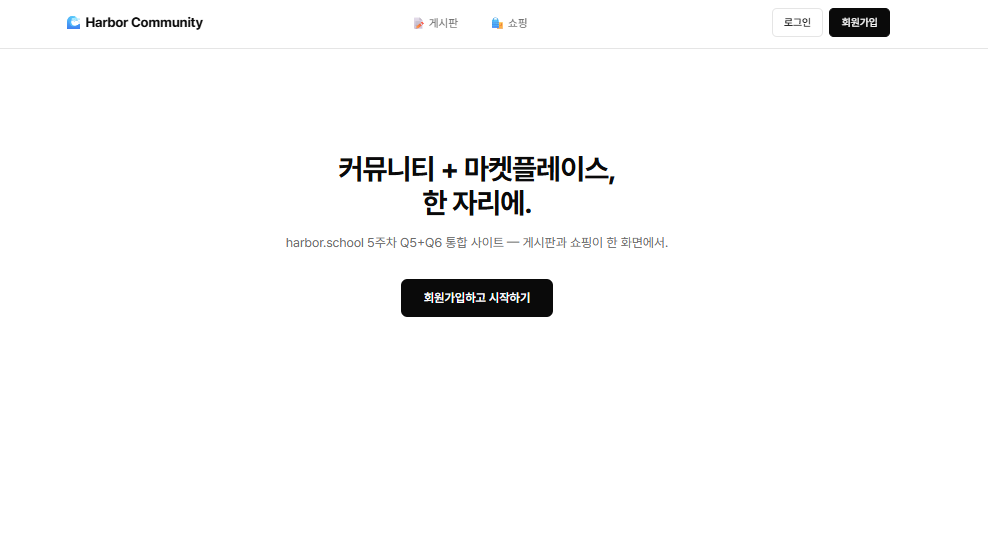
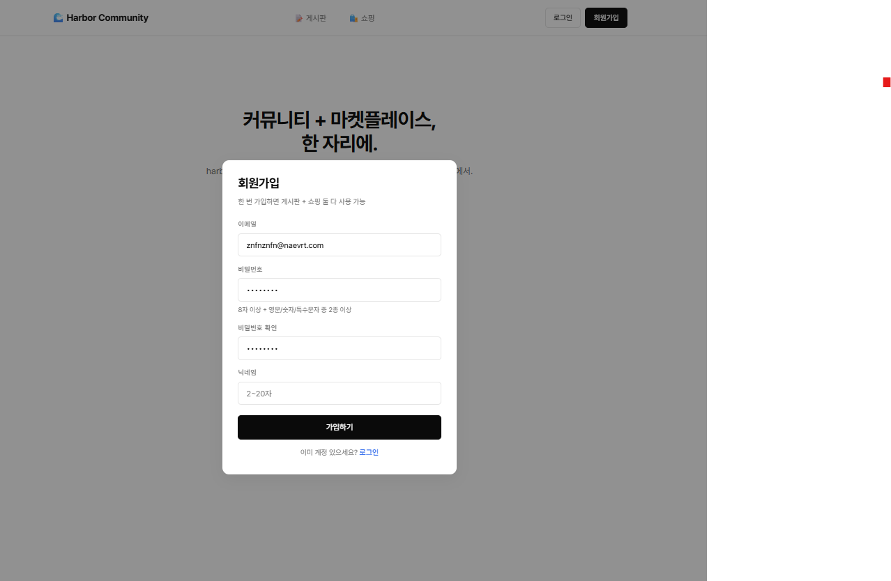
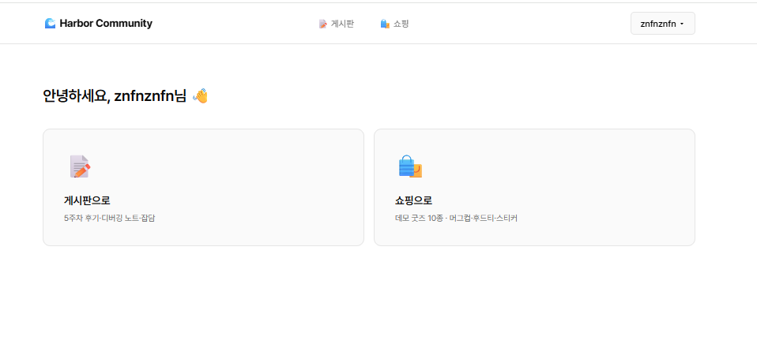

# Harbor Community

5주차 PRIME Q5(게시판) + Q6(쇼핑)을 하나의 회원제 SPA로 통합한 프로젝트.

## 라이브
- 🌐 https://harbor-community.vercel.app/
- 🗂 GitHub: https://github.com/mmake7/harbor-community
- 📅 라이브 검증: 2026-05-01 — 회원가입·게시판(글/댓글/반응)·쇼핑(카트/주문) 모두 정상

## 미션 충족 매핑

증빙 스크린샷은 [↓ 스크린샷 섹션](#스크린샷) 참조.

| 미션 | 충족 화면 | 증빙 SS |
|---|---|---|
| Q5 게시판: 글 CRUD | `#/board`, `#/board/new`, `#/board/post/{id}` | Q5/s1·s2·s4 |
| Q5: 댓글 | `#/board/post/{id}` 하단 | Q5/s3 |
| Q5: 반응(좋아요/하트/불) | `#/board/post/{id}` 👍❤️🔥 | Q5/s3 |
| Q6 쇼핑: 상품 목록 | `#/shop` | Q6/s1 |
| Q6: 상품 상세 | `#/shop/product/{id}` | Q6/s2 |
| Q6: 장바구니 | `#/shop/cart` | Q6/s3 |
| Q6: 주문 + 스냅샷 | `#/shop/orders`, `#/shop/order/{id}` | Q6/s4 |
| 인증 (공통 인프라) | 회원가입/로그인 모달 | B1/01·02·03 |

## 스크린샷

### Phase 1 — 인증 (B1)

| 게스트 홈 | 회원가입 검증 | 로그인 후 |
|---|---|---|
|  |  |  |

### Q5 — 게시판

| 글 목록 | 글 작성 |
|---|---|
|  |  |

| 글 상세 + 댓글 + 반응 | 글 수정/삭제 |
|---|---|
|  |  |

### Q6 — 쇼핑

| 상품 목록 | 상품 상세 |
|---|---|
|  |  |

| 카트 화면 | 주문 상세 |
|---|---|
|  |  |

## 기술 스택
- 프론트: React 18 (CDN + Babel Standalone), Vanilla, no build
- 백엔드: Vercel Serverless Functions (Node.js, pg 직접 연결)
- DB: Supabase Postgres (스키마: app)
- 인증: JWT 7일 + bcryptjs 10 rounds
- 폰트: Pretendard Variable

## API 설계 — ?view= 분기 패턴
Vercel Hobby 12 함수 한도 대응. 한 파일에 ?view=로 여러 동작 묶음.

| 파일 | view 수 | 인증 |
|---|---|---|
| `/api/auth` | 4 (register/login/me/logout) | register·login 무, me·logout 유 |
| `/api/posts` | 7 (list/get/create/update/delete/comment/react) | list·get 무, 나머지 유 |
| `/api/shop` | 9 (products/product/cart/cart_add/cart_update/cart_clear/order_create/orders/order) | products·product 무, 나머지 유 |

총 함수 3개 / 20 endpoint (Hobby 12 함수 한도 중 3개 사용, 9개 여유)

## 구현 규모
- 백엔드: 1,106줄 (auth 226 + posts 359 + shop 471 + auth-helper 50)
- 화면: 2,015줄 (단일 SPA `public/index.html`)
- DB: 9 테이블 (auth_users, auth_sessions, community_posts, community_comments, community_reactions, shop_products, shop_cart_items, shop_orders, shop_order_items)
- 시드: shop_products 10건

## 디렉토리
```
harbor-community/
├── api/
│   ├── auth.js
│   ├── posts.js
│   └── shop.js
├── lib/
│   ├── auth-helper.js
│   └── datetime.js
├── public/
│   └── index.html
├── sql/
│   ├── 001_create_auth_tables.sql
│   ├── 002_create_community_tables.sql
│   ├── 003_create_shop_tables.sql
│   └── 004_seed_shop_products.sql
├── screenshots/
│   ├── B1/   (3장 — 인증)
│   ├── Q5/   (4장 — 게시판 미션)
│   └── Q6/   (4장 — 쇼핑 미션)
├── scripts/
│   └── apply.js
├── README.md
├── package.json
├── vercel.json
└── dev-server.js
```

## 환경변수 (Vercel)
- `DATABASE_URL`: Supabase Pooler URL
- `JWT_SECRET`: 임의 32자 이상 랜덤 문자열

## 보안 노트 (5주차 수준)
- 토큰: localStorage 저장 (XSS 위험 있음, 운영 환경에선 httpOnly cookie 권장)
- 결제: 미구현 (status='pending' 고정)
- 가격 스냅샷: shop_order_items에 product_name + product_price 저장 (상품 변경 후에도 과거 주문 금액 불변)
- 주문 트랜잭션: FOR UPDATE 락 + 6단계 (카트조회/재고검증/주문생성/항목생성/재고차감/카트비우기)
- 동시성: deadlock 방지 위해 cart 락 ORDER BY product_id ASC

## 로컬 실행
```powershell
cd harbor-community
npm install
# .env.local 작성 (DATABASE_URL + JWT_SECRET)
node scripts/apply.js   # SQL 적용
node dev-server.js      # http://localhost:3002
```

## 배포 (Vercel)
GitHub main 브랜치 push 시 자동 배포. 환경변수는 Vercel 대시보드에서 등록.
