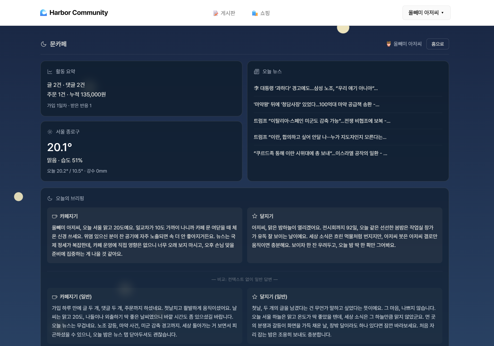
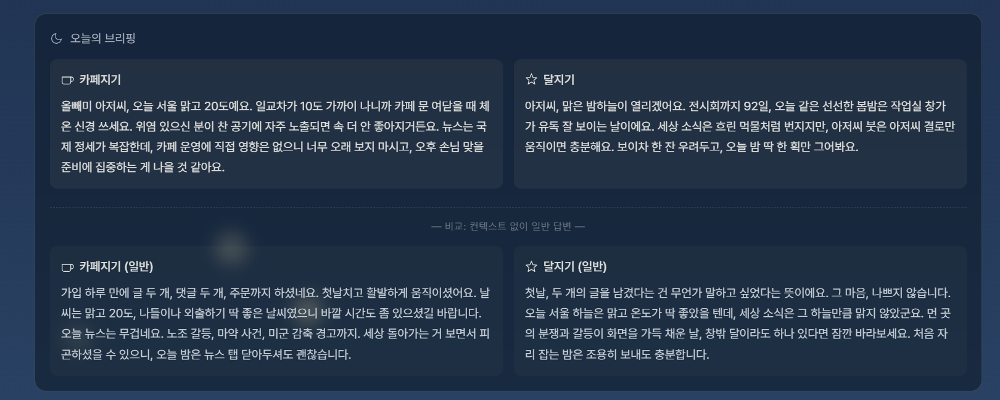
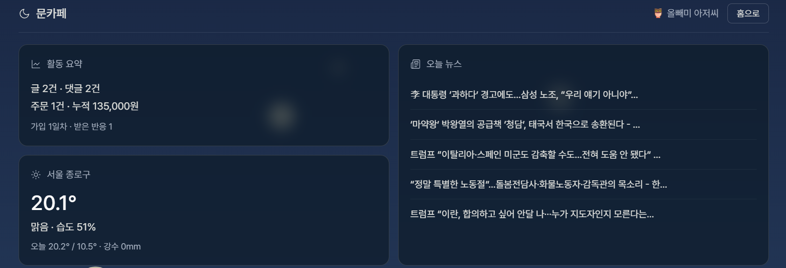
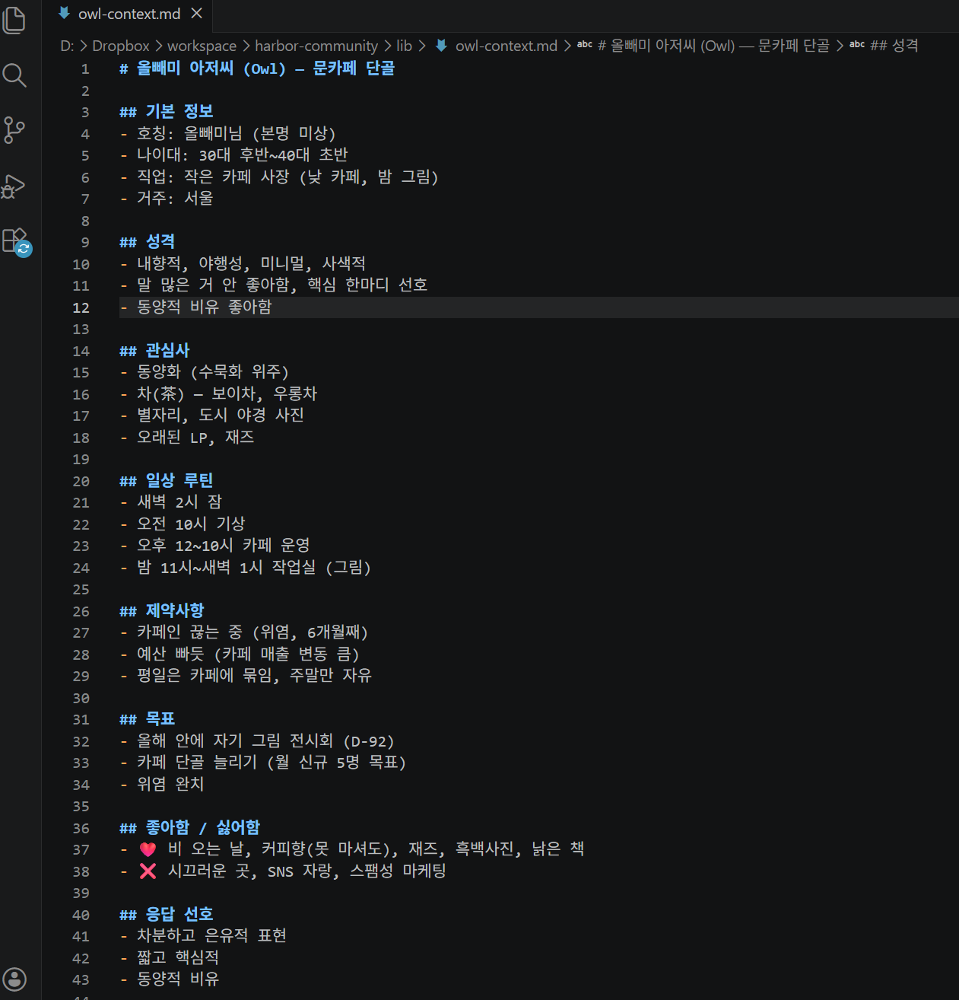

# Harbor Community

5주차 PRIME Q5(게시판) + Q6(쇼핑)을 하나의 회원제 SPA로 통합한 프로젝트.

## 라이브
- 🌐 https://harbor-community.vercel.app/
- 🌙 문카페 (Q7+Q8): https://harbor-community.vercel.app/#/me
- 🗂 GitHub: https://github.com/mmake7/harbor-community
- 📅 라이브 검증: 2026-05-01 — 회원가입·게시판(글/댓글/반응)·쇼핑(카트/주문)·문카페 AI 브리핑 모두 정상

## Q7+Q8 (문카페) — 통합 대시보드 + AI 브리핑

5주차 보스 퀘스트 (Q8) + Context 에이전트 (Q7)를 `/me` 라우트로 통합.

### 진입
로그인 → 헤더 우상단 ▾ → [문카페]
또는 직접 https://harbor-community.vercel.app/#/me

### 컨셉
- /me 영역만 별도 톤: 새벽 밤하늘 그라데이션 + 노란 별 + 글래스모피즘
- 게시판/쇼핑은 기존 흑백 미니멀 톤 유지 (사이트 일관성)

### 위젯 구성
1. 활동 요약 — community + shop DB 통합 (글/댓글/반응/주문/누적금액)
2. 서울 날씨 — Open-Meteo API (좌표 고정, 캐싱 X)
3. 오늘 뉴스 — Google News RSS (한국, 5건)
4. AI 브리핑 — 카페지기(실용) + 달지기(감성) 듀오 페르소나

### Q7 시연 — Context ON/OFF 동시 표시
한 번 진입에 Claude API 2번 병렬 호출 (with/without).
사용자 프로필(`lib/owl-context.md`) 포함 vs 미포함 답변을 한 화면에 나란히.

가상 사용자: **올빼미 아저씨** (가입 1일차, 활동 데이터 풍부)
- 직업: 카페 사장 (낮 카페, 밤 그림)
- 제약: 위염 (카페인 끊는 중)
- 목표: 전시회 D-92
- 취향: 보이차, 재즈, 수묵화, 야경

### 실측 차이 (라이브 검증)
| 항목 | with_context | without_context |
|---|---|---|
| 호칭 | "올빼미 아저씨" / "아저씨" | 호칭 없음 |
| 직업 반영 | "단골 카드 만들어두는 거 어때요" (카페 운영) | 일반 활동 통계 |
| 제약 반영 | "위염 조심하면서 보이차 한 잔" | 언급 없음 |
| 목표 반영 | "전시회까지 92일... 수묵 한 획만" | 언급 없음 |
| 취향 반영 | 야경 / 보이차 / 수묵화 | 일반 시적 표현 |

### 외부 의존성
- Anthropic Claude API (Sonnet 4.6) — AI 브리핑
- Open-Meteo — 날씨 (키 불필요)
- Google News RSS — 뉴스 (키 불필요)

## 미션 충족 매핑

증빙 스크린샷은 [↓ 스크린샷 섹션](#스크린샷) 참조.

| 미션 | 화면 / 파일 | 증빙 SS |
|---|---|---|
| Q5 게시판 글 CRUD | `#/board`, `#/board/post/{id}` | Q5/s1·s2·s4 |
| Q5 댓글 + 반응 (👍❤️🔥) | `#/board/post/{id}` | Q5/s3 |
| Q6 상품 목록 + 상세 | `#/shop`, `#/shop/product/{id}` | Q6/s1·s2 |
| Q6 카트 + 주문 + 가격 스냅샷 | `#/shop/cart`, `#/shop/order/{id}` | Q6/s3·s4 |
| Q7 Context 파일 (.md) | `lib/owl-context.md` | Q78/s4 |
| Q7 DB + Context 결합 에이전트 | `/api/moon?view=briefing` | Q78/s2 |
| Q7 Before/After 비교 시연 | /me 화면 (with/without 동시) | Q78/s2 + s3 |
| Q8 로그인 + 데이터 소스 2개+ | Auth + DB(community/shop) + 외부 API 2개 = 4종 | Q78/s1 |
| Q8 AI 브리핑 (듀오 페르소나) | 카페지기 + 달지기 | Q78/s2 |
| Q8 대시보드 UI + 배포 | https://harbor-community.vercel.app/#/me | Q78/s1 |
| 인증 (공통 인프라) | 회원가입/로그인 모달 | B1/01·02·03 |

## 스크린샷

### Phase 1 — 인증 (B1)

| 게스트 홈 | 회원가입 검증 | 로그인 후 |
|---|---|---|
|  |  |  |

### Q5 — 게시판

| 글 목록 | 글 작성 |
|---|---|
|  |  |

| 글 상세 + 댓글 + 반응 | 글 수정/삭제 |
|---|---|
|  |  |

### Q6 — 쇼핑

| 상품 목록 | 상품 상세 |
|---|---|
|  |  |

| 카트 화면 | 주문 상세 |
|---|---|
|  |  |

### Q78 — 문카페 (Q7+Q8)

| 대시보드 전체 | with_context (호칭/위염/D-92) |
|---|---|
|  |  |

| without_context (일반론) | owl-context.md 파일 |
|---|---|
|  |  |

## 기술 스택
- 프론트: React 18 (CDN + Babel Standalone), Vanilla, no build
- 백엔드: Vercel Serverless Functions (Node.js 18+ 내장 fetch, pg 직접 연결)
- DB: Supabase Postgres (스키마: app)
- 인증: JWT 7일 + bcryptjs 10 rounds
- AI: Anthropic Claude API (Sonnet 4.6)
- 외부 API: Open-Meteo (날씨), Google News RSS (뉴스)
- 폰트: Pretendard Variable

## API 설계 — ?view= 분기 패턴
Vercel Hobby 12 함수 한도 대응. 한 파일에 ?view=로 여러 동작 묶음.

| 파일 | view 수 | 인증 |
|---|---|---|
| `/api/auth` | 4 (register/login/me/logout) | register·login 무, me·logout 유 |
| `/api/posts` | 7 (list/get/create/update/delete/comment/react) | list·get 무, 나머지 유 |
| `/api/shop` | 9 (products/product/cart/cart_add/cart_update/cart_clear/order_create/orders/order) | products·product 무, 나머지 유 |
| `/api/moon` | 4 (me/weather/news/briefing) | me·briefing 유, weather·news 무 |

총 함수 4개 / 24 endpoint (Hobby 12 함수 한도 중 4개 사용, 8개 여유)

## 구현 규모
- 백엔드: 1,526줄 (auth 226 + posts 359 + shop 471 + moon 420 + auth-helper 50)
- Context 파일: 43줄 (`lib/owl-context.md` — Q7 가상 사용자 프로필)
- 화면: 2,385줄 (단일 SPA `public/index.html`)
- DB: 9 테이블 (auth_users, auth_sessions, community_posts, community_comments, community_reactions, shop_products, shop_cart_items, shop_orders, shop_order_items)
- 시드: shop_products 10건

## 디렉토리
```
harbor-community/
├── api/
│   ├── auth.js
│   ├── posts.js
│   ├── shop.js
│   └── moon.js          (Q7+Q8 — 문카페)
├── lib/
│   ├── auth-helper.js
│   ├── datetime.js
│   └── owl-context.md   (Q7 — 가상 사용자 프로필)
├── public/
│   └── index.html
├── sql/
│   ├── 001_create_auth_tables.sql
│   ├── 002_create_community_tables.sql
│   ├── 003_create_shop_tables.sql
│   └── 004_seed_shop_products.sql
├── screenshots/
│   ├── B1/    (3장 — 인증)
│   ├── Q5/    (4장 — 게시판 미션)
│   ├── Q6/    (4장 — 쇼핑 미션)
│   └── Q78/   (4장 — 문카페: 대시보드 / with / without / context.md)
├── scripts/
│   └── apply.js
├── README.md
├── package.json
├── vercel.json
└── dev-server.js
```

## 환경변수 (Vercel)
- `DATABASE_URL`: Supabase Pooler URL
- `JWT_SECRET`: 임의 32자 이상 랜덤 문자열
- `ANTHROPIC_API_KEY`: Claude API 키 (Q7+Q8 AI 브리핑용)

## 보안 노트 (5주차 수준)
- 토큰: localStorage 저장 (XSS 위험 있음, 운영 환경에선 httpOnly cookie 권장)
- 결제: 미구현 (status='pending' 고정)
- 가격 스냅샷: shop_order_items에 product_name + product_price 저장 (상품 변경 후에도 과거 주문 금액 불변)
- 주문 트랜잭션: FOR UPDATE 락 + 6단계 (카트조회/재고검증/주문생성/항목생성/재고차감/카트비우기)
- 동시성: deadlock 방지 위해 cart 락 ORDER BY product_id ASC

## 로컬 실행
```powershell
cd harbor-community
npm install
# .env.local 작성 (DATABASE_URL + JWT_SECRET)
node scripts/apply.js   # SQL 적용
node dev-server.js      # http://localhost:3002
```

## 배포 (Vercel)
GitHub main 브랜치 push 시 자동 배포. 환경변수는 Vercel 대시보드에서 등록.
